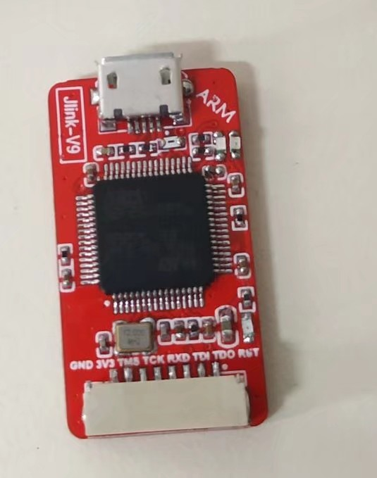
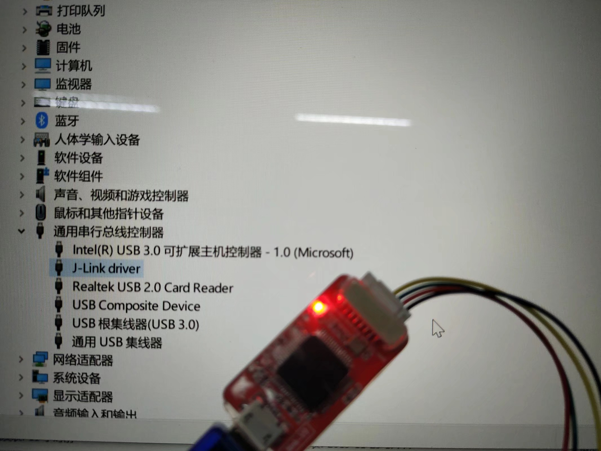
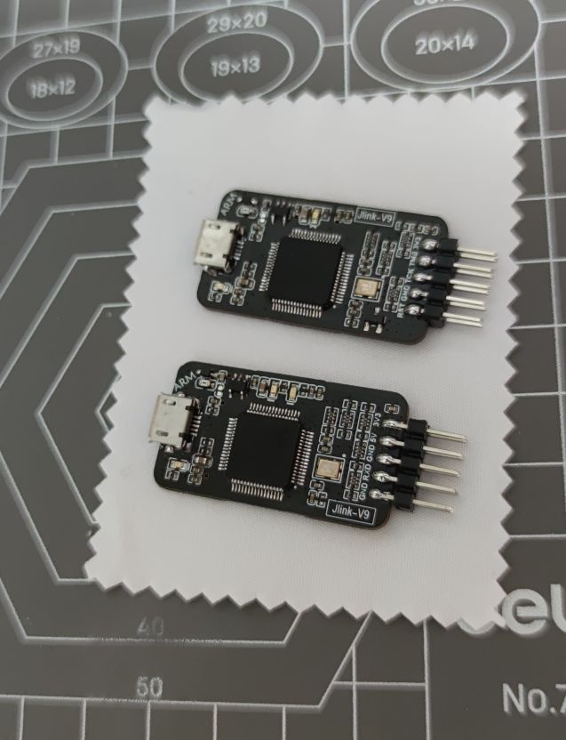
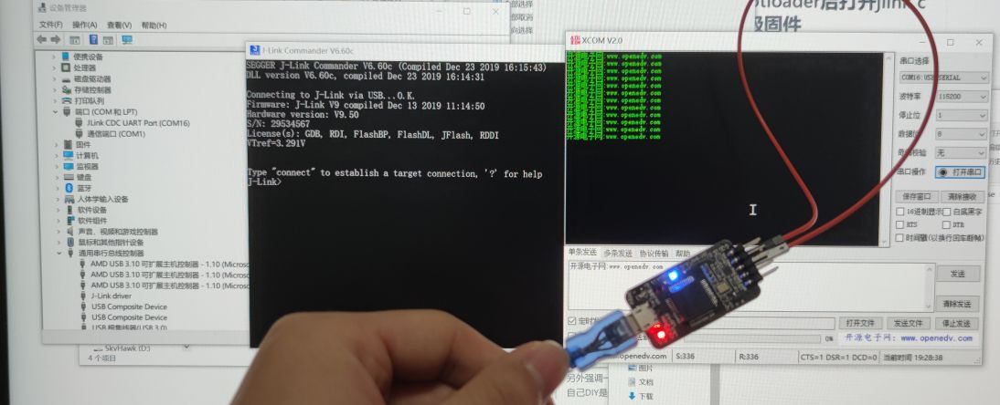
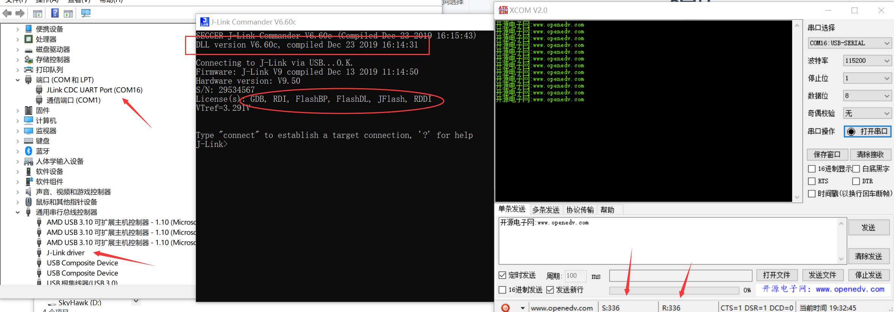

# JlinkV9
DIY Jlink V9 debugger

~~上传了当时DIY的PCB工程，具体烧固件的步骤记不清了，等PCB改版焊完再记录详细的步骤~~

~~可先看这个帖子（我也是用这位大佬的PCB改的，但是他没放整个工程）~~

2020-12-26已更新烧固件教程

V1版抄的这位大佬的，但是虚拟串口TX不行（可能是我焊的问题）

http://www.openedv.com/forum.php?mod=viewthread&tid=284972

V1焊完如下：

刷完固件：

但是V1的电阻太多，焊起来要命，所以就有了V2 SMT版，刚好有券，上JLC贴了阻容，回来十几分钟就焊好了MCU、USB座、1N5819、保险丝、LDO、排针

SMT的画了两次，第一次画的还是用的V1的原理图，由于基础库排阻种类有限，改了电阻阻值，结果TX正常，RX不正常，然后看到了这位大佬开源的板子（感谢万能的群友分享的）：

https://github.com/Kevincoooool/MCU_Link_Diy

抄了大佬的原理图，用上JLC的封装库，再改下输出排针的顺序，把常用的SWD的四根线放到正面，就有了这次分享的板子，整个PCB工程已经上传，贴片用的文件也有，指定位置加客编也有，PCB+SMT（用50元贴片券），花了18.36（上次19.13），不用券就是70左右，当然板子数量越多越划算了

V2的焊完如下：

烧进bootloader、添加SN和license、升级到最新固件：

再测试下虚拟串口：

最后放上公众号和QQ群的二维码，欢迎加群吹牛。

